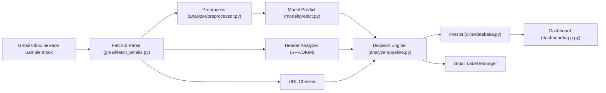

# Architecture

## Жоғары деңгейлі схема

## Негізгі компоненттер

- `main.py`
  - scanner orchestration
  - retry/backoff
  - periodic polling
- `model/`
  - baseline + bert training/eval
  - prediction backend auto-selection
- `analyzer/`
  - text cleaning
  - URL risk analysis
  - SPF/DKIM heuristics
  - risk-level aggregation
- `utils/database.py`
  - scan нәтижелерін сақтау
  - summary/stats query
- `dashboard/app.py`
  - статистика және scan history көрсету

## Runtime flow

1. `main.py` settings жүктейді (`utils/config.py`).
2. Gmail service ашылады (немесе sample fallback).
3. Әр email үшін `scan_email` орындалады.
4. `ScanResult` DB-ға жазылады.
5. `phishing_probability > threshold` болса Gmail label қойылады.
6. Dashboard DB-дан summary және history көрсетеді.

## Data flow және state

- Input state:
  - Gmail message payload немесе `data/raw/sample_inbox.json`
- Processing state:
  - preprocessed text
  - model probability
  - url/header findings
- Persistent state (SQLite):
  - email metadata
  - scan run metadata
  - per-scan classification
  - per-url findings

## Тәуелділік қабаттары

- Infra: `utils/config.py`, `utils/logger.py`, `utils/database.py`
- Domain: `utils/schemas.py`, `analyzer/*`
- Integration: `gmail/*`
- Application: `main.py`, `dashboard/app.py`
- ML tooling: `data/*`, `model/*`

